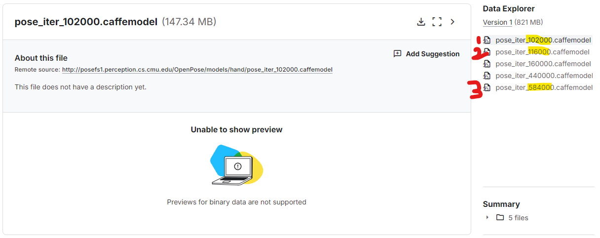

# Smplify-X-Perfect-Implementation
  
**[Smplify-X](https://github.com/vchoutas/smplify-x) implementation. (2025. 01. 14 No Error & Recent version)**  
**🚶🏻‍♂️Quick start(colab)**: [](https://colab.research.google.com/drive/1OoGEg8doFA3-3f_5XkA895C9xR9nf-ob?usp=sharing)  
> I modified [🌟SMPLpix](https://github.com/sergeyprokudin/smplpix) code. Please check!

### Code Overview
```python
gender = 'female' #@param ["neutral", "female", "male"]

!rm -rf /content/data/smplifyx_results
%cd /content/Smplify-X-Perfect-Implementation
!git pull origin

!python smplifyx/main.py --config cfg_files/fit_smplx.yaml \
    --data_folder  /content/data \
    --output_folder /content/data/smplifyx_results \
    --visualize=True \
    --gender=$gender \
    --model_folder /content/smplx/models_smplx_v1_1/models \
    --vposer_ckpt /content/vposer/V02_05\
    --part_segm_fn smplx_parts_segm.pkl
```
  
## Dependency (important; update 2024. 08. 30)
### (1) Download smplx model checkpoint
  
1. Install [SMPL-X Body Model](https://smpl-x.is.tue.mpg.de/).
2. Install [VPoser V2.0](https://smpl-x.is.tue.mpg.de/).
3. Install [OpenPose](https://github.com/svikramank/openpose)
```python
# Donwload Openpose
## There is code in colab. (Don't worry!!)

%cd /content
import os
from os.path import exists, join, basename, splitext

git_repo_url = 'https://github.com/CMU-Perceptual-Computing-Lab/openpose.git'
project_name = splitext(basename(git_repo_url))[0]
if not exists(project_name):
  # see: https://github.com/CMU-Perceptual-Computing-Lab/openpose/issues/949
  # install new CMake becaue of CUDA10
  !wget -q https://cmake.org/files/v3.13/cmake-3.13.0-Linux-x86_64.tar.gz
  !tar xfz cmake-3.13.0-Linux-x86_64.tar.gz --strip-components=1 -C /usr/local

  # clone openpose
  !git clone -q --depth 1 $git_repo_url
  # download models
  !wget -O /content/openpose/models/hand/pose_iter_102000.caffemodel https://polybox.ethz.ch/index.php/s/Oim76cuqrDVbdxm/download
  !wget -O /content/openpose/models/pose/body_25/pose_iter_584000.caffemodel https://polybox.ethz.ch/index.php/s/m5NQAhd7ukVPRoL/download
  !wget -O /content/openpose/models/face/pose_iter_116000.caffemodel https://polybox.ethz.ch/index.php/s/cEaF1FTpKjjJZbH/download
  !sed -i 's/execute_process(COMMAND git checkout master WORKING_DIRECTORY ${CMAKE_SOURCE_DIR}\/3rdparty\/caffe)/execute_process(COMMAND git checkout f019d0dfe86f49d1140961f8c7dec22130c83154 WORKING_DIRECTORY ${CMAKE_SOURCE_DIR}\/3rdparty\/caffe)/g' openpose/CMakeLists.txt
  # install system dependencies
  !apt-get -qq install -y libatlas-base-dev libprotobuf-dev libleveldb-dev libsnappy-dev libhdf5-serial-dev protobuf-compiler libgflags-dev libgoogle-glog-dev liblmdb-dev opencl-headers ocl-icd-opencl-dev libviennacl-dev
  # install python dependencies
  !pip install -q youtube-dl
  # build openpose
  !cd openpose && rm -rf build || true && mkdir build && cd build && cmake .. && make -j`nproc`
```
  
### (2) Download openpose model checkpoint (new⭐)
  
Before implement code, you need to download `openpose` 3 checkpoints manually.
- [Hand checkpoint](https://www.kaggle.com/datasets/changethetuneman/openpose-model?select=pose_iter_102000.caffemodel)
- [Pose checkpoint](https://www.kaggle.com/datasets/changethetuneman/openpose-model?select=pose_iter_584000.caffemodel)
- [Face checkpoint](https://www.kaggle.com/datasets/changethetuneman/openpose-model?select=pose_iter_116000.caffemodel)
  
And then, make folders and move checkpoints.
```python
## In colab, you can find below code
# move checkpoint below folders (manually)
!mkdir /content/gdrive/MyDrive/openpose
!mkdir /content/gdrive/MyDrive/openpose/hand # 102000.caffemodel
!mkdir /content/gdrive/MyDrive/openpose/pose # 584000.caffemodel
!mkdir /content/gdrive/MyDrive/openpose/face # 116000.caffemodel
```
  
## Quick Start🚶
Colab Code: [](https://colab.research.google.com/drive/1OoGEg8doFA3-3f_5XkA895C9xR9nf-ob?usp=sharing)  
> You may use L4 or A100 GPU. (2024.12.20)  

## GuideLine
**0. If you get a warning about restarting the kernel, ignore it and click Cancel.**
  
1. Input your images in `/content/data/images` folder.
  
2. Implement `OpenPose` and get **keypoints**.
```python
# In colab, there is code.
## Automatic download packages and keypoints save. (Don't worry!!)

%cd /content
KEYPOINTS_DIR = os.path.join(RES_DIR, 'keypoints')
OPENPOSE_IMAGES_DIR = os.path.join(RES_DIR, 'openpose_images')
!mkdir $KEYPOINTS_DIR
!mkdir $OPENPOSE_IMAGES_DIR

!cd openpose && ./build/examples/openpose/openpose.bin --image_dir /content/data/images --write_json $KEYPOINTS_DIR --face --hand --display 0 --write_images $OPENPOSE_IMAGES_DIR

input_img_path = os.path.join(FRAMES_DIR, sorted(os.listdir(FRAMES_DIR))[0])
openpose_img_path = os.path.join(OPENPOSE_IMAGES_DIR, sorted(os.listdir(OPENPOSE_IMAGES_DIR))[0])

test_img = load_img(input_img_path)
open_pose_img = load_img(openpose_img_path)

plt.figure(figsize=(10, 10))
plt.title("Input Frame + Openpose Prediction")
plt.imshow(np.concatenate([test_img, open_pose_img], 1))
```
  
3. Prepare `VPoser` and `SMPL-X` models in your Google Drive.
```python
!mkdir /content/gdrive/MyDrive/smplify-x/
!mkdir /content/gdrive/MyDrive/smplify-x/vposer
!mkdir /content/gdrive/MyDrive/smplify-x/smplx
```
> You upload the `zip` files in each folder.  
```python
# In colab, it is required.
## SMPLX_ZIP_PATH and VPOSER_ZIP_PATH

%cd /content/
from google.colab import drive
drive.mount('/content/gdrive')

SMPLX_ZIP_PATH = '/content/gdrive/MyDrive/smplify-x/smplx/models_smplx_v1_1.zip' # @param {type:"string"}
VPOSER_ZIP_PATH = '/content/gdrive/MyDrive/smplify-x/vposer/V02_05.zip' # @param {type:"string"}

SMPLX_MODEL_PATH = '/content/smplx'
!mkdir $SMPLX_MODEL_PATH
!unzip -n $SMPLX_ZIP_PATH -d $SMPLX_MODEL_PATH
VPOSER_MODEL_PATH = '/content/vposer'
!mkdir $VPOSER_MODEL_PATH
!unzip -n $VPOSER_ZIP_PATH -d $VPOSER_MODEL_PATH
```
  
## How to fix errors?
1. Install recent version VPoser and modifed code.
```python
# In fit_single_frame.py (example)

## Original
from human_body_prior.tools.model_loader import load_vposer

## Modified (below)
from human_body_prior.tools.model_loader import load_model 
from human_body_prior.models.vposer_model import VPoser
``` 
  
2. Change VPoser implementation code
```python
# In fitting.py (example)

## Original
body_pose = vposer.decode(pose_embedding, output_type='aa').view(1, -1) if use_vposer else None

## Modified
body_pose = (vposer.decode(pose_embedding).get( 'pose_body')).reshape(1, -1) if use_vposer else None
```
  
## Option (3D visualization)
```python
from vedo import Mesh

mesh = Mesh("./sample/000.obj",)
#mesh.texture("./sample/sample.jpg")

mesh.show()
```
  
## References
[smplify-x](https://github.com/vchoutas/smplify-x)  
[Issues 144](https://github.com/vchoutas/smplify-x/issues/144)  
[Issues 166](https://github.com/vchoutas/smplify-x/issues/166)  
[🌟SMPLpix](https://github.com/sergeyprokudin/smplpix)  
